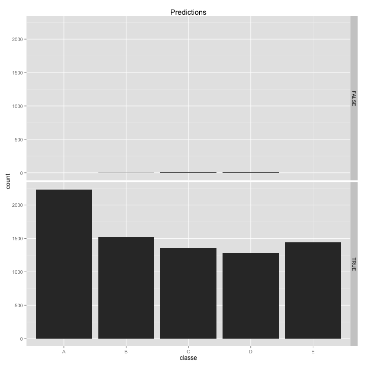

### Synopsis
Using devices such as Jawbone Up, Nike FuelBand, and Fitbit it is now possible to collect a large amount of data about personal activity relatively inexpensively. These type of devices are part of the quantified self movement – a group of enthusiasts who take measurements about themselves regularly to improve their health, to find patterns in their behavior, or because they are tech geeks. One thing that people regularly do is quantify how much of a particular activity they do, but they rarely quantify how well they do it. In this project, your goal will be to use data from accelerometers on the belt, forearm, arm, and dumbell of 6 participants. They were asked to perform barbell lifts correctly and incorrectly in 5 different ways. More information is available from the website here: <http://groupware.les.inf.puc-rio.br/har> (see the section on the Weight Lifting Exercise Dataset). 

The goal of the project is to predict the manner in which they did the exercise. This is the "classe" variable in the training set. From this I will build a model, cross validate, discuss the expected out of sample error is and use the prediction model to predict 20 different test cases. 

### Data Processing

#### Set global settings
Ensuring that the correct library is loaded for knitr and setting the global chunk options(note that I do set the working directory but have not included that line for privacy):

```r
library(knitr)     
library(caret);
library(randomForest);
library(ggplot2);

set.seed(555666)

opts_chunk$set(warning = FALSE, message = FALSE, echo = TRUE, cache = TRUE, 
               fig.width = 10, fig.height = 10)
```
Note that the `echo = FALSE` parameter was added to the code chunk to prevent printing of the R code that generated the plot.  `warning = FALSE` and `message = FALSE` are added to remove the uncessary warnings and messages when producing the plots.  Finally added `fig.width/height = 10` to make the plots wider and easier to read; for this exercise I have also added `cache = TRUE` to help reduce the runtimes.

#### Read in raw data

This stage reads in the .csv files and then reads in ready for use:

```r
# Read in the required data
trainurl<-"https://d396qusza40orc.cloudfront.net/predmachlearn/pml-training.csv"
testurl<-"https://d396qusza40orc.cloudfront.net/predmachlearn/pml-testing.csv"


# Set the name of the file we wish to extract
trainfile <- "pml-training.csv"
testfile <- "pml-testing.csv"

# If data file has not yet been downloaded then fetch it otherwise move on
if (!file.exists(trainfile)) {
  download.file(trainurl, destfile=trainfile, method="curl")
}

if (!file.exists(testfile)) {
  download.file(testurl, destfile=testfile, method="curl")
}

## Create the necessary tables for the data
traindata <- read.table(trainfile, sep=",", dec=".", header = TRUE, na.strings=c("NA",""))
predictdata <- read.table(testfile, sep=",", dec=".", header = TRUE, na.strings=c("NA",""))

# Clean up the Environment for clarity
rm(testfile, trainfile, testurl, trainurl)

# Clean up the set and remove the first colume (that represents the ID Row)
traindata <- traindata[,-1] 
predictdata <- predictdata[,-1]
```

### Data Splitting

To perform the analysis we need to split the data into the training sample i.e. where we build our model, and the testing set where we validate and test out model.

```r
# Data splitting (using a 60% split for our training data)
inTrain <- createDataPartition(traindata$classe, p=0.60, list=FALSE)
training <- traindata[inTrain, ]
testing <- traindata[-inTrain, ]
```

### Data Cleansing
Given I am going to use the random forest method I need to clear out the NA values otherwise I will get fatal errors and don't want to define the na.error method for this piece of work.

```r
## Review data for columns containing missing data (if number is greater than 0 then cleanse)
sum((colSums(!is.na(training[,-ncol(training)])) < 1*nrow(training)))
```

```
## [1] 100
```

```r
# Only retain those columns that have complete data (I am not spending time understanding and replacing missing values)
Keep <- c((colSums(!is.na(training[,-ncol(training)])) >= 1*nrow(training)))
training   <-  training[,Keep]
testing <- testing[,Keep]
predictdata <- predictdata[,Keep]

# Clean up the Environment for clarity
rm(Keep, inTrain, traindata)

# Check again and should be 0 (given we have cleansed the data)
sum((colSums(!is.na(training[,-ncol(training)])) < 1*nrow(training)))
```

```
## [1] 0
```

### Model Creation

My chosen model is randomForest for its greater level of accuracy and also the data I am using isn't large enough for performance to be an issue.

```r
# The package has been added at the beginning of the code
modFit <- randomForest(classe~., data=training, importance=TRUE, keep.forest=TRUE)
print(modFit)
```

```
## 
## Call:
##  randomForest(formula = classe ~ ., data = training, importance = TRUE,      keep.forest = TRUE) 
##                Type of random forest: classification
##                      Number of trees: 500
## No. of variables tried at each split: 7
## 
##         OOB estimate of  error rate: 0.14%
## Confusion matrix:
##      A    B    C    D    E class.error
## A 3347    1    0    0    0   0.0002987
## B    4 2275    0    0    0   0.0017552
## C    0    2 2051    1    0   0.0014606
## D    0    0    3 1926    1   0.0020725
## E    0    0    0    5 2160   0.0023095
```
The outputs are looking good, we have very few false positives and false negatives and the OOB Error Rate it low (especially given Efrom and Tibshiarani (1993) saying "the bootstrap samples used to compute the [OOB error rate] are further away on the average than a typical test sample, by a factor of 1/.632." In other words, Efron and Tibshirani argue that OOB-based error estimates tend to be pessimistic).


```r
# Run the prediction based upon the modFit model created and the testing data
predictions<-predict(modFit, testing)
confusionMatrix(predictions, testing$classe)
```

```
## Confusion Matrix and Statistics
## 
##           Reference
## Prediction    A    B    C    D    E
##          A 2232    2    0    0    0
##          B    0 1516    5    0    0
##          C    0    0 1362    3    0
##          D    0    0    1 1283    0
##          E    0    0    0    0 1442
## 
## Overall Statistics
##                                         
##                Accuracy : 0.999         
##                  95% CI : (0.997, 0.999)
##     No Information Rate : 0.284         
##     P-Value [Acc > NIR] : <2e-16        
##                                         
##                   Kappa : 0.998         
##  Mcnemar's Test P-Value : NA            
## 
## Statistics by Class:
## 
##                      Class: A Class: B Class: C Class: D Class: E
## Sensitivity             1.000    0.999    0.996    0.998    1.000
## Specificity             1.000    0.999    1.000    1.000    1.000
## Pos Pred Value          0.999    0.997    0.998    0.999    1.000
## Neg Pred Value          1.000    1.000    0.999    1.000    1.000
## Prevalence              0.284    0.193    0.174    0.164    0.184
## Detection Rate          0.284    0.193    0.174    0.164    0.184
## Detection Prevalence    0.285    0.194    0.174    0.164    0.184
## Balanced Accuracy       1.000    0.999    0.998    0.999    1.000
```

The model is still looking good with a very low level for false +ve/-ve and a high accuracy rate.

```r
# Pull out the accuracy figure from the table
accur <- postResample(predictions, testing$classe)
model_accuracy <- accur[[1]]*100
model_accuracy
```

```
## [1] 99.86
```

Every time a split of a node is made on variable m the gini impurity criterion for the two descendent nodes is less than the parent node. Adding up the gini decreases for each individual variable over all trees in the forest gives a fast variable importance that is often very consistent with the permutation importance measure.

```r
# Run a varPlot to look at the importance of the variables
varImpPlot(modFit, type=2)
```

 

```r
# Clean up the Environment for clarity
rm(accur, model_accuracy, predictions)
```

### Cross validation and error estimates
In random forests, there is no need for cross-validation or a separate test set to get an unbiased estimate of the test set error. It is estimated internally, during the run, as follows:

Each tree is constructed using a different bootstrap sample from the original data. About one-third of the cases are left out of the bootstrap sample and not used in the construction of the kth tree.

Put each case left out in the construction of the kth tree down the kth tree to get a classification. In this way, a test set classification is obtained for each case in about one-third of the trees. At the end of the run, take j to be the class that got most of the votes every time case n was oob. The proportion of times that j is not equal to the true class of n averaged over all cases is the oob error estimate. This has proven to be unbiased in many tests. (Source: Leo Breiman and Adele Cutler).

Before we move on I just want to look at the TRUE vs. FALSE (which does show us a great degree of accuracy).  The predictions make me comfortable that I am not seeing overfitting.

```r
pred <- predict(modFit, testing);
testing$predRight <- pred==testing$classe;
qplot(classe, data=testing, main="Predictions") +
  facet_grid(predRight ~ .)
```

 

### Applying model to new observations

#### Create the base dataset

This stage reads in the .csv files and then reads in ready for use:

```r
# Use the data from earlier and remove the additional unecessary problem ID column at end of file
predictdata <- predictdata[,-ncol(predictdata)] 

# Get the data into the same format as the training set (using the training data as a base) 
testing <- rbind(training[1, -59] , predictdata) 

# Remove the first row that we added from the trianing set and rename to rownames (this is important so the output matches up for the Submission of the 20 predictions later)
testing<-testing[-1,]
row.names(testing) <- c(1:20)

# Clean up the Environment for clarity
rm(predictdata, training)
```

The new model is run and the prediction for the 20 new obversations is stored and outputed (ready for scoring later):

```r
# Run the model on the new data and print results
pred_final <- predict(modFit, testing)
print(pred_final)
```

```
##  1  2  3  4  5  6  7  8  9 10 11 12 13 14 15 16 17 18 19 20 
##  B  A  B  A  A  E  D  B  A  A  B  C  B  A  E  E  A  B  B  B 
## Levels: A B C D E
```

```r
# Clean up the Environment for clarity
rm(testing, modFit)
```

Finally I put the data into a format ready for the Submission phase of the assignment.  The prediction must have work as scored 20/20.

```r
# Add final part to get scores ready for assessment
pml_write_files = function(x){
  n = length(x)
  for(i in 1:n){
    filename = paste0("./submission/problem_id_",i,".txt")
    write.table(x[i],file=filename,quote=FALSE,row.names=FALSE,col.names=FALSE)
  }
}

# Invoke function and produce output
pml_write_files(pred_final)
```

#### Produce the .md output

The code below is commented out as it cause the knit to fail (but wanted it here for completeness):

```r
## Produces the knitr output required (not included in the R Markdown files)
#  knit("PML Prediction Assigment.Rmd")  

# There is a setwd to the submissions folder but I have removed this
```

##### ScubaSteve22. August 2014.
